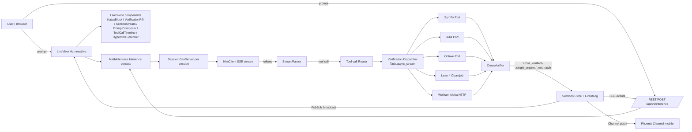

# Tech Stack

Full breakdown of every technology choice, the rationale behind it, and the alternatives considered. This document is the source of truth for "what are we using and why"; see [VISION.md](./VISION.md) for the "what are we building and why that shape"; see [`openspec/changes/add-math-inference-backbone/design.md`](./openspec/changes/add-math-inference-backbone/design.md) for the full decision log with historical context.

> **Invariant this stack serves**: LLMs are never in the verification path. Symbolic engines are the sole ground truth. Every choice below is evaluated against whether it helps enforce that invariant cheaply and observably.

## System architecture



The critical path has one rule: **no edge into the renderer exists from the LLM that does not first pass through the dispatcher and cross-verifier.** The rendering Svelte components reject any section whose status is not `:verified`, `:cross_verified`, or `:single_engine`.

## Backend

### Elixir 1.19 / Erlang OTP 28

**What it does**: the runtime for everything on the server. BEAM scheduling runs the NIM streaming client, the session GenServers, the verifier Ports, the dispatcher, the cross-verifier, the PubSub broadcast, and the LiveView processes.

**Why**:

- **Fault-tolerant supervision** is exactly what a multi-engine verifier pool needs. If a SymPy subprocess crashes on pathological input, OTP restarts it without taking the session down.
- **`Task.async_stream` with kill-on-timeout** is the idiomatic pattern for parallel dispatch with a deadline. Implementing this in Node or Python would mean reaching for a worker pool library; in OTP it is a standard-library primitive.
- **PubSub is built in.** Broadcasting section state transitions to every connected client is one function call.
- **LiveView delivers streaming UX** without client-side hydration cost. Model tokens reach the browser as they arrive with no React reconciliation tax.
- **The five prior repos that used Elixir/Phoenix (the strongest ones structurally) stayed in Elixir.** The ones that left Elixir regretted it.

**Alternatives considered**:

- **Node.js + AI SDK v6**: excellent LLM ecosystem, but loses BEAM supervision for verifier subprocesses and introduces a client-side hydration cost the author is trying to avoid.
- **Rails 8 + Hotwire**: `kimi-math-chat` tried this; Rust NIF integration was brittle and Hotwire's streaming story is weaker than LiveView for the Hypertime scrubber use case.
- **Loco.rs / Iced**: Rust-first options. Rejected because the Elixir ecosystem for LLM tool-calling and streaming is stronger today and the math verification sidecars (Python, Julia, Lean 4) would still require subprocess bridges regardless of web framework.

### Phoenix 1.8 + LiveView + LiveSvelte

**What it does**: the web framework. Phoenix provides routing, controllers, channels, and the context pattern. LiveView handles server-rendered reactive UI. LiveSvelte embeds Svelte 5 components inside LiveView with props bridged over the LiveView channel.

**Why**:

- **Phoenix contexts give us the dual-client pattern for free**: `MathInference.Inference.run/1` is called by both the LiveView handler and the REST controller. The business logic lives in one place.
- **LiveView delivers 60 Hz server-driven UI** without a SPA build step for the non-interactive parts.
- **LiveSvelte covers the fine-grained reactivity gaps**: Hypertime scrubber, KaTeX editor, parameter explorer. LiveView round-trips would feel laggy for these; full Svelte components with local runes state and LiveSvelte props feel native.
- **OpenAPI via `open_api_spex`** is generated from the Elixir controllers, so the contract for native clients cannot drift from the server implementation without failing CI.

**Alternatives considered**:

- **Pure Heex in slice 1, LiveSvelte in slice 2**: faster to ship slice 1, but forces a second refactor when we add interactive widgets.
- **LiveReact**: exists, but Svelte 5 runes are cleaner for the kind of fine-grained reactivity the Hypertime scrubber needs.

### Dual-client transport: LiveView + REST + SSE + Phoenix Channels

**What it does**: four transports, one set of contexts. LiveView for the web UI, REST `POST /api/v1/inference` for native clients, SSE `GET /api/v1/sessions/:id/events` for event streams to native clients that cannot hold a WebSocket, Phoenix Channels for mobile real-time.

**Why**:

- **REST + SSE is the lowest-friction portable surface.** `openapi-generator-cli` produces Swift and Kotlin clients automatically from OpenAPI 3.1.
- **LiveView only** would foreclose native iOS / Android / desktop clients. The author explicitly requested portability.
- **GraphQL via Absinthe** was considered; subscriptions over WebSocket duplicate LiveView channels, and GraphQL's flexible queries are not needed here.
- **gRPC via `grpc-elixir`** was considered; adds operational complexity on Railway (HTTP/2 tooling) and native clients generate more easily from OpenAPI than from `.proto`.

### Persistence

- **Slice 1**: ETS and/or Agent for the session store and the Hypertime event log. Zero setup cost, zero deployment cost, adequate for a single-operator harness.
- **Slice 2+**: Ecto + Postgres 16 for durable sections and durable event logs. Postgres is the Railway default and supports the audit-trail requirement.

**Why the split**: there is no reason to pay Ecto's complexity tax until persistence is needed. Slice 1's job is to prove the pipeline works end-to-end, not to be production-durable.

## Frontend

### Svelte 5 (runes) + Vite

**What it does**: Svelte 5 is the component model; runes provide the reactivity primitive; Vite is the dev server and build tool. Svelte components are embedded inside LiveView via LiveSvelte.

**Why**:

- **Svelte 5 runes** give fine-grained reactivity without the store ceremony of Svelte 4. For the Hypertime scrubber, which updates state at 60 Hz, this matters.
- **Vite** is replacing `esbuild` in the Phoenix asset pipeline via `phx_vite` because the LiveSvelte + Svelte 5 + TypeScript story on Vite is better-supported and because HMR latency in Vite is lower.
- **No React.** React's hydration cost and reconciliation model are the wrong tradeoff for a server-streamed UI where Phoenix already owns most of the DOM.

### Tailwind CSS v4

**What it does**: utility-first CSS with a `@theme` directive and zero JS runtime.

**Why**:

- **v4's `@import "tailwindcss"` and `@theme` block** are simpler than the v3 PostCSS plugin config. One import, one theme block, done.
- **The Railway aesthetic** (obsidian dark, 1 px gradient borders, monospace uppercase labels, subtle status-pill glow) is straightforward to encode as theme tokens.
- **Zero JS runtime cost**: Tailwind compiles classes, ships nothing to the browser beyond CSS.

### SaladUI primitives

**What it does**: a set of unstyled, accessible component primitives (dialog, dropdown, tabs, tooltip, etc.) designed for Phoenix + LiveView + Heex.

**Why**: gives us accessible primitives without the Heex-to-React impedance mismatch that `shadcn/ui` forces on a Phoenix app. SaladUI components are Heex-native and compose with LiveSvelte cleanly.

### GSAP (GSAP-Standard license)

**What it does**: motion. Transitions, ScrollTrigger, Flip, easing, timelines.

**Why**:

- **ScrollTrigger and Flip** are exactly the primitives the Hypertime scrubber needs. Motion One (the 4 kb alternative) lacks both.
- **GSAP became free** under the GSAP-Standard license after the Webflow acquisition, so there is no cost penalty.
- **Framer Motion** is React-only and not applicable inside Svelte.

**Budget**: every animation caps at 300 ms total duration and 180 ms per state transition. `prefers-reduced-motion` is respected on every animated component. Motion that distracts from the mathematics is removed.

### Phosphor Icons via `unplugin-icons`

**What it does**: the icon set is Phosphor (six weights: thin / light / regular / bold / fill / duotone). Icons are imported as inline SVG at build time via `unplugin-icons` + `@iconify-json/ph`.

**Why**:

- **Six weights** matter for signaling verification state — a `:pending` icon at `thin` and a `:verified` icon at `fill` communicate state without needing a separate color system.
- **`unplugin-icons`** compiles unused icons out of the bundle at build time. Bundle cost is effectively zero for icons you don't use.
- **Lucide** is an alternative but has only one stroke weight, which is not enough for this use case.

### KaTeX

**What it does**: renders LaTeX to HTML/MathML. The `KatexBlock` Svelte component wraps KaTeX and adds a copy-LaTeX button.

**Why**: KaTeX is fast (synchronous, no worker) and has better rendering quality than MathJax 3 for the subset of LaTeX this project uses. MathJax's async rendering creates visual pop-in that feels wrong next to streamed tokens.

## LLM provider

### NVIDIA NIM (OpenAI-compatible streaming)

**What it does**: the inference provider. Authenticated via `NIM_API_KEY`. Accessed over HTTPS as a streaming OpenAI-compatible endpoint.

**Why**:

- **Free tier** accommodates single-operator research.
- **OpenAI-compatible** means the streaming client is a thin `Req` wrapper, not a bespoke integration.
- **Model menu** includes competitive models suitable for math routing and narration.

**Non-goals**: no fine-tuned or self-hosted models in slice 1. The author's scope is routing and narration quality, not model training.

## Verification engines

Every engine implements `MathInference.Verification.Behaviour`:

```elixir
@callback verify(input :: map()) :: {:ok, result :: map()} | {:error, reason :: any()}
@callback health_check() :: :ok | {:error, reason :: any()}
@callback capabilities() :: [atom()]
```

Adding a new engine means adding one module and registering it in the supervisor. No other module needs to change.

### SymPy (slice 1)

**What it does**: the first-in, primary symbolic engine for slice 1. Runs as a persistent Python 3.13 stdin/stdout JSON daemon (`priv/python/sympy_worker.py`) wrapped by a `MathInference.Verification.SymPy` Port with a crash-recovery GenServer. A Poolboy pool provides parallelism.

**Why**:

- **SymPy's coverage** is the broadest of any free engine: calculus, linear algebra, ODEs, integrals, series, simplification.
- **Port daemon pattern** avoids paying Python startup cost on every verification. The `zig-elixir-math-katex` repo already proved this pattern at small scale.
- **Free and local.** No network dependency.

**Status**: wired in slice 1 as the single verifier for the first vertical slice.

### Julia (slice 2+)

**What it does**: numerical verification where SymPy is slow or inexact. Symbolic manipulation via `Symbolics.jl` when appropriate.

**Why**: Julia is faster than SymPy for heavy numerical work and has strong packages for ODEs (`DifferentialEquations.jl`) and linear algebra.

### GNU Octave (slice 2+)

**What it does**: numerical second-opinion engine. Particularly strong for linear algebra and signal processing.

**Why**: free MATLAB-compatible, widely available, and provides a cheap numerical cross-check when the problem has a numerical result.

### Lean 4 (slice 2+)

**What it does**: formal proof verification for selected theorems.

**Why**: Lean 4 is the only engine in this stack that provides actual mathematical proof. It is also the slowest — cold-start latency is 15–30 seconds — so it runs as an Oban background job, not inline. The section renders with a `:pending` proof badge that resolves to `:verified` or `:failed` asynchronously.

### Wolfram Alpha (slice 2+, optional)

**What it does**: cloud-hosted symbolic engine, authenticated via `WOLFRAM_APP_ID`. Used as a cross-verification oracle when SymPy and Julia disagree or when the problem is outside SymPy's comfort zone.

**Why**: Wolfram's coverage is unmatched. Making it optional keeps the `$0 baseline` for operators who do not have a Wolfram key.

### Parallel dispatch with cross-verification

The dispatcher fans a single verification request to every applicable engine in parallel via `Task.async_stream` with bounded concurrency and `:kill_task` on timeout. Results flow into `MathInference.Verification.CrossVerifier.compare/1`, which returns one of:

- `:cross_verified` — two or more engines agree within tolerance. Highest confidence.
- `:single_engine` — one engine succeeded; others timed out or were not applicable. Rendered with a warning pill.
- `:verification_mismatch` — engines disagree. Section does not render without user override.
- `:failed` — every engine errored. Section renders as an error pill.

The `results_match?/2` function inherits the SymPy numeric-tolerance + symbolic-simplification TODO from `zig-elixir-math-katex` and is being hardened in slice 1.

## Prompt library

**What it does**: five system prompts ported verbatim from `math-chat/PROMPTS.md` into `priv/prompts/*.md`, loaded via `MathInference.Prompts.get/2`.

| Prompt | Role |
| --- | --- |
| `Orchestrator` | high-level problem framing and routing |
| `Parser` | extracts mathematical structure from natural-language input |
| `Vision` | OCR-adjacent extraction from image input (prompt ported, not wired in slice 1) |
| `Tutor` | Socratic recursive-question narration |
| `Verifier` | formats results for user presentation after symbolic verification |

**Why prompts are first-class artifacts**:

- Each file carries frontmatter (`name`, `version`, `target_model`, `last_verified_at`).
- Stale prompts (not revalidated in 30 days) surface telemetry warnings.
- Prompts can be diffed, reviewed, and versioned independently of code. Inlining them in module attributes would lose syntax highlighting and make iteration harder.

## Development environment

### Nix flake

**What it does**: one `flake.nix` pins Elixir 1.19 / OTP 28, Node 24, Python 3.13 + SymPy + NumPy, Julia, GNU Octave, Lean 4, and Postgres 16. `flake-utils.lib.eachDefaultSystem` targets `aarch64-darwin` (local) and `x86_64-linux` (Railway build).

**Why**:

- **Five language runtimes is too many to install ad hoc.** One `nix develop` and a developer has a working environment.
- **Reproducibility across macOS and Linux** is load-bearing: the local machine is `aarch64-darwin`, production is `x86_64-linux`.
- **The flake outputs double as the Railway Nixpacks contract.** The same definition that runs locally produces the production image.
- **Alternatives rejected**: `asdf` / `mise` cannot pin system libraries (Lean 4's dependencies, Octave's BLAS). Docker Compose adds runtime overhead for interactive macOS development.

### `direnv` with `use flake`

Auto-enters the Nix dev shell on `cd`. Documented in `AGENTS.md` as the canonical entry point.

## Code quality

### Single `mix ci` target

One command that runs every check:

```
mix format --check-formatted
mix credo --strict
mix dialyzer
mix test --cover
eslint
prettier --check
svelte-check
tsc --noEmit
ruff check
ruff format --check
mypy --strict
pytest
JuliaFormatter --check
lake build
nix flake check
mix openapi.check      # fails if open_api_spex drifts from priv/openapi.json
```

**Why one target**: so contributors (human or agent) run one command and get green-or-fail. No "which step did you forget?" failure mode.

### Lefthook pre-commit

Runs the subset of `mix ci` that is bounded to staged files, so commits are fast but never dirty. Full `mix ci` runs in CI.

### Language-specific strictness

- **Elixir**: `mix format` is the single source of truth. `mix credo --strict`. `mix dialyzer` in CI.
- **TypeScript**: strict mode on. `tsc --noEmit` plus `svelte-check`.
- **Python**: Ruff format + lint. `mypy --strict` on every `priv/python/*.py` file.
- **Julia**: `JuliaFormatter` checks in CI.
- **Lean 4**: `lake build` must succeed.

### Conventional Commits

`type(scope): description`. One coherent change per commit. PRs with mixed-concern commits get rebased or squashed before merge.

## Observability

- **Telemetry** for inference and verification events. Every engine emits `verification_started`, `verification_finished`, `verification_timeout`, and `cross_verification_mismatch`.
- **Phoenix LiveDashboard** for process introspection.
- **Langfuse** (slice 2+, optional) for LLM tracing and cost tracking.

## Testing

- **ExUnit** for all Elixir code. Integration tests exercise full context flows with mocked NIM streams and mocked verifier Ports.
- **Vitest** for Svelte component unit tests. At minimum `VerificationPill`, `SectionStream`, and `HypertimeScrubber`.
- **pytest** for Python verifier sidecars.
- **Playwright** in a later slice for browser-driven verification of the full pipeline.
- **Verification-first invariant tests**: every pipeline test asserts that the rendered content of a section matches its verification status. The zero-unverified-renders guarantee is test-enforced, not just architected.

## Deployment

### Railway via Nixpacks (slice 3+)

**What it does**: production hosting. Nixpacks auto-detects the Nix flake and builds the image from it.

**Why**:

- **Railway is simpler than Fly.io** for a single-region single-operator harness. Fly's multi-region clustering story is excellent but not needed here.
- **The Nix flake is already the build contract**, so deployment reproducibility comes for free.
- **Free starter tier** keeps the zero-cost baseline intact.

**Slice boundary**: no production deployment in slice 1. Local-first development until the full vertical slice passes through a real browser.

## Zero-cost baseline

Every dependency above is OSS or has a free tier that accommodates single-operator development:

- NVIDIA NIM: free tier
- Railway: starter tier (slice 3+)
- Langfuse: free tier (slice 2+)
- Everything else (Phoenix, Svelte, Tailwind, GSAP, Phosphor, SymPy, Julia, Octave, Lean 4, Nix): open source

Production stays at `$0` until usage grows enough to need a paid tier.

## Carried-forward TODOs from prior art

- **`results_match?/2` hardening**: inherit the SymPy numeric-tolerance + symbolic-simplification TODO from `zig-elixir-math-katex` and fix it in slice 1.
- **Prompt staleness telemetry**: new in this project; emit a warning when `last_verified_at` is older than 30 days.
- **OpenAPI drift check**: CI fails if `open_api_spex` generates a spec that differs from the committed `priv/openapi.json`.
- **Cross-verifier notation disagreements**: the numeric-tolerance tests need cases for `sin(pi)` vs `0`, `1/2` vs `0.5`, and common trigonometric identity mismatches.
